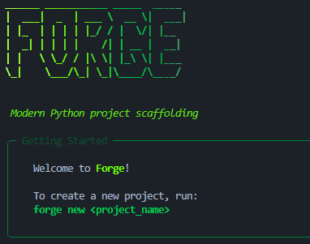

# Forge CLI



A command-line tool for scaffolding Python projects with an interactive, guided experience.

## Requirements

- Python 3.11+
- [uv](https://docs.astral.sh/uv/getting-started/installation/)

## Dev setup
```bash
git clone https://github.com/<username>/forge-cli
cd forge-cli
uv sync
uv pip install -e .
```

## Usage
```bash
forge new my_project
```

Forge will guide you through:

1. Project type — From Scratch, FastAPI, Flask or Django
2. Test library — pytest, unittest, doctest
3. Docker — optional Dockerfile and docker-compose setup

## What gets generated

| Option | Files created |
|---|---|
| From Scratch | `main.py`, `.env.example` |
| FastAPI | `main.py`, `.env.example` |
| Flask | `app.py`, `.env.example` |
| Django | Django project structure, `.env.example` |
| + Docker | `Dockerfile`, `docker-compose.yml`, `.dockerignore` |
| + Tests | `tests/__init__.py`, `tests/test_main.py` |

## License

MIT